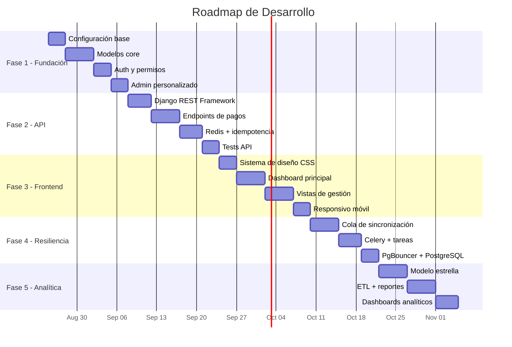
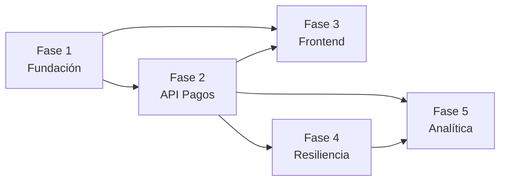

# Sistema-de-Gestion-de-Rutas

#  Plan de Desarrollo por Fases — Sistema de Colectivos

## Resumen Ejecutivo

El proyecto se divide en **5 fases incrementales**. Cada fase entrega un producto funcional que se puede probar y validar antes de avanzar a la siguiente. Las fases están ordenadas por **dependencia técnica** y **valor de negocio**.



---

## FASE 1: Fundación del Sistema 
> **Prioridad:  CRÍTICA** — Sin esto no existe nada
> **Estimación: ~2 semanas**

### Objetivo
Configurar el proyecto Django correctamente, crear los modelos de datos core y tener un admin funcional para gestionar la información base.

### 1.1 Configuración del Proyecto
- [ ] Migrar de SQLite → **PostgreSQL**
- [ ] Configurar `django-environ` para variables de entorno (`.env`)
- [ ] Configurar `LANGUAGE_CODE = 'es-ve'` y `TIME_ZONE` correcto
- [ ] Estructura de apps según arquitectura propuesta
- [ ] Docker Compose para desarrollo (PostgreSQL + Redis)
- [ ] `requirements.txt` con dependencias base

### 1.2 Modelos Core — App `fleet` (Flota)
```python
# Lo que construiremos:
Empresa         → Operadores/dueños de líneas
Linea           → Línea de colectivo (ej: "Ruta 5 - Centro")
Ruta            → Recorrido geográfico de una línea
Parada          → Puntos de la ruta
Unidad          → Colectivo/bus individual
Conductor       → Persona que opera la unidad
AsignacionTurno → Qué conductor opera qué unidad y cuándo
```

### 1.3 Modelos Core — App `accounts` (Usuarios)
```python
# Modelo de usuario personalizado:
Usuario         → Extiende AbstractUser (OBLIGATORIO hacerlo en Fase 1)
Rol             → Admin, Operador, Inspector, Conductor
```

> [!CAUTION]
> El **modelo de usuario personalizado** (`AUTH_USER_MODEL`) DEBE crearse en la Fase 1 antes de la primera migración. Cambiarlo después es extremadamente difícil.

### 1.4 Admin Personalizado
- [ ] Instalar `django-unfold` para admin moderno
- [ ] Registrar todos los modelos con filtros, búsqueda y acciones
- [ ] Carga de datos iniciales (fixtures) para pruebas

### Entregable Fase 1
 Admin funcional donde se pueden crear empresas, líneas, rutas, paradas, unidades y conductores. Base de datos PostgreSQL configurada.

### Estructura de archivos — Fase 1
```
Proyecto/
├── Core/
│   ├── settings/
│   │   ├── __init__.py
│   │   ├── base.py          # Settings compartidos
│   │   ├── development.py   # Settings de desarrollo
│   │   └── production.py    # Settings de producción
│   ├── urls.py
│   └── wsgi.py
├── apps/
│   ├── __init__.py
│   ├── accounts/
│   │   ├── models.py        # Usuario personalizado, Rol
│   │   ├── admin.py
│   │   ├── managers.py      # UserManager personalizado
│   │   └── ...
│   └── fleet/
│       ├── models.py        # Empresa, Linea, Ruta, Parada, Unidad, Conductor
│       ├── admin.py
│       └── ...
├── .env                      # Variables de entorno (NO va al repo)
├── .env.example              # Template de variables
├── docker-compose.yml        # PostgreSQL + Redis
├── requirements.txt
└── manage.py
```

---

## FASE 2: API Transaccional de Pagos 
> **Prioridad:  CRÍTICA** — El core del negocio
> **Estimación: ~2.5 semanas**
> **Depende de: Fase 1**

### Objetivo
Construir la API REST que recibe pagos desde los validadores en los colectivos, con garantía de idempotencia y alta concurrencia.

### 2.1 App `payments` (Pagos)
```python
# Modelos:
MedioPago       → Tipo de medio (RFID, QR, NFC, efectivo)
Tarjeta         → Tarjeta/billetera del pasajero
Transaccion     → Pago individual (APPEND-ONLY, nunca se edita)
LoteSync        → Lote de transacciones sincronizadas desde unidad offline
```

> [!IMPORTANT]
> La tabla `Transaccion` usará **`BigAutoField`** como PK y será **particionada por mes** en PostgreSQL para rendimiento con millones de registros.

### 2.2 Django REST Framework — Endpoints

| Endpoint | Método | Descripción |
|---|---|---|
| `/api/v1/pagos/` | POST | Registrar un pago (desde validador) |
| `/api/v1/pagos/lote/` | POST | Sincronizar lote offline |
| `/api/v1/tarjetas/{id}/saldo/` | GET | Consultar saldo de tarjeta |
| `/api/v1/tarjetas/{id}/recargar/` | POST | Recargar tarjeta |
| `/api/v1/unidades/{id}/recaudacion/` | GET | Recaudación del día por unidad |
| `/api/v1/lineas/{id}/recaudacion/` | GET | Recaudación del día por línea |

### 2.3 Redis — Idempotencia y Caché
- [ ] Cada pago llega con un `idempotency_key` (UUID del validador)
- [ ] Redis verifica en microsegundos si ya fue procesado
- [ ] TTL de 24h para las claves de idempotencia
- [ ] Caché de saldos de tarjetas frecuentes

### 2.4 Autenticación de Validadores
- [ ] Token por unidad (cada colectivo tiene su token API)
- [ ] Rate limiting por unidad
- [ ] Logging de todas las transacciones

### 2.5 Tests
- [ ] Tests unitarios de serializers y modelos
- [ ] Tests de integración de endpoints
- [ ] Tests de concurrencia (pagos simultáneos)
- [ ] Test de idempotencia (mismo pago enviado 2 veces)

### Entregable Fase 2
 API REST funcional que puede recibir pagos, validar idempotencia, consultar saldos y recaudación. Documentada con Swagger/OpenAPI.

---

## FASE 3: Frontend Responsivo 
> **Prioridad:  ALTA** — Interfaz para operar el sistema
> **Estimación: ~2.5 semanas**
> **Depende de: Fase 1 y 2**

### Objetivo
Crear un dashboard web responsivo (mobile-first) para administradores, operadores e inspectores.

### 3.1 Sistema de Diseño
- [ ] CSS custom con variables (colores, tipografía, espaciado)
- [ ] Componentes base: cards, tablas, formularios, modales
- [ ] Layout responsivo con CSS Grid/Flexbox
- [ ] Tema oscuro/claro

### 3.2 App `dashboard` — Vistas principales

| Vista | Usuarios | Descripción |
|---|---|---|
| **Dashboard Home** | Admin, Operador | KPIs, gráficos de recaudación, estado de flota |
| **Mapa de Rutas** | Admin, Operador | Mapa interactivo con rutas y paradas |
| **Gestión de Flota** | Admin | CRUD unidades, conductores, asignaciones |
| **Gestión de Líneas** | Admin | CRUD líneas, rutas, paradas |
| **Monitor de Pagos** | Admin, Operador | Transacciones en tiempo real |
| **Recaudación** | Admin, Operador | Reportes por día/línea/unidad |
| **Mi Unidad** | Conductor | Vista simplificada para conductores (móvil) |

### 3.3 Tecnología Frontend
```
Django Templates + HTMX + Alpine.js
├── HTMX        → Interactividad sin recargar página (búsquedas, filtros, paginación)
├── Alpine.js   → Micro-interacciones (modales, toggles, dropdowns)
├── Chart.js    → Gráficos de recaudación
└── Leaflet.js  → Mapas interactivos (si se necesita)
```

> [!NOTE]
> Este stack mantiene todo en un solo proyecto Django. No necesitas un frontend separado. HTMX + Alpine.js dan una experiencia moderna sin la complejidad de React/Vue.

### 3.4 Responsividad Móvil
- [ ] Diseño **mobile-first** (se diseña para móvil primero, después desktop)
- [ ] Menú hamburguesa en móvil
- [ ] Tablas que se convierten en cards en móvil
- [ ] Touch-friendly: botones grandes, gestos swipe
- [ ] PWA manifest para "instalar" como app

### Entregable Fase 3
 Dashboard web completo, responsivo, funcional en celulares y escritorio. Los operadores pueden gestionar la flota y ver recaudación desde el teléfono.

---

## FASE 4: Sincronización Offline y Resiliencia 
> **Prioridad:  MEDIA-ALTA** — Necesario para producción real
> **Estimación: ~2 semanas**
> **Depende de: Fase 2**

### Objetivo
Garantizar que el sistema funcione cuando los colectivos pierden señal de red, y que la infraestructura soporte carga real.

### 4.1 App `sync` (Sincronización)
```python
# Modelos:
ColaSync        → Cola de transacciones pendientes por sincronizar
EstadoUnidad    → Último heartbeat, estado de conexión por unidad
LogSync         → Historial de sincronizaciones exitosas/fallidas
```

### 4.2 Protocolo de Sincronización
- [ ] Validador almacena localmente cuando no hay red
- [ ] Al recuperar señal, envía lote comprimido (gzip)
- [ ] API valida cada transacción del lote por idempotencia
- [ ] Responde con confirmación parcial (cuáles se aceptaron, cuáles ya existían)

### 4.3 Celery — Tareas en Background
- [ ] Procesamiento asíncrono de lotes grandes
- [ ] Envío de alertas (unidad sin reportar >2h)
- [ ] Cierre automático de caja diaria por unidad
- [ ] Generación de reportes programados

### 4.4 Infraestructura de Producción
- [ ] PgBouncer para pool de conexiones PostgreSQL
- [ ] Particionamiento de tabla `Transaccion` por mes
- [ ] Índices optimizados para queries frecuentes
- [ ] Nginx como reverse proxy
- [ ] Gunicorn con workers configurados
- [ ] Health checks y monitoring básico

### Entregable Fase 4
 Sistema resiliente que soporta unidades offline, procesa lotes de sincronización, y tiene infraestructura de producción lista.

---

## FASE 5: Analítica y Data Warehouse 
> **Prioridad:  MEDIA** — Valor agregado, no bloquea operación
> **Estimación: ~2.5 semanas**
> **Depende de: Fase 2 y 4**

### Objetivo
Implementar el modelo estrella propuesto en el README para reportería avanzada y toma de decisiones.

### 5.1 App `analytics` (Analítica)
```python
# Modelo Estrella:
FactPago        → Tabla de hechos (monto, fecha_id, unidad_id, linea_id)
DimTiempo       → Dimensión tiempo (año, mes, día, hora, día_semana)
DimUnidad       → Dimensión unidad (placa, tipo, empresa)
DimLinea         → Dimensión línea (nombre, zona, municipio)
DimMedioPago    → Dimensión medio de pago
```

### 5.2 ETL con Celery
- [ ] Tarea nocturna que extrae de OLTP → Modelo Estrella
- [ ] Agregaciones pre-calculadas por día/línea/unidad
- [ ] Limpieza de datos y detección de anomalías

### 5.3 Reportes Avanzados
- [ ] Recaudación histórica con filtros (fecha, línea, empresa)
- [ ] Comparativas mes a mes, año a año
- [ ] Detección de fraude (patrones anómalos)
- [ ] Exportación a PDF/Excel
- [ ] Dashboard analítico separado del operativo

### 5.4 Opcional: Integración con BI
- [ ] API para conectar con Metabase/Redash/Grafana
- [ ] Endpoints de datos agregados para visualización externa

### Entregable Fase 5
 Data warehouse funcional con modelo estrella, reportes avanzados de recaudación, y capacidad de análisis histórico.

---

##  Resumen de Fases

| Fase | Nombre | Prioridad | Estimación | Depende de |
|---|---|---|---|---|
| **1** | Fundación del Sistema |  Crítica | ~2 semanas | — |
| **2** | API Transaccional |  Crítica | ~2.5 semanas | Fase 1 |
| **3** | Frontend Responsivo |  Alta | ~2.5 semanas | Fases 1, 2 |
| **4** | Resiliencia y Sync |  Media-Alta | ~2 semanas | Fase 2 |
| **5** | Analítica y DW |  Media | ~2.5 semanas | Fases 2, 4 |

> **Tiempo total estimado: ~11.5 semanas** (asumiendo 1 desarrollador a tiempo completo)



---
