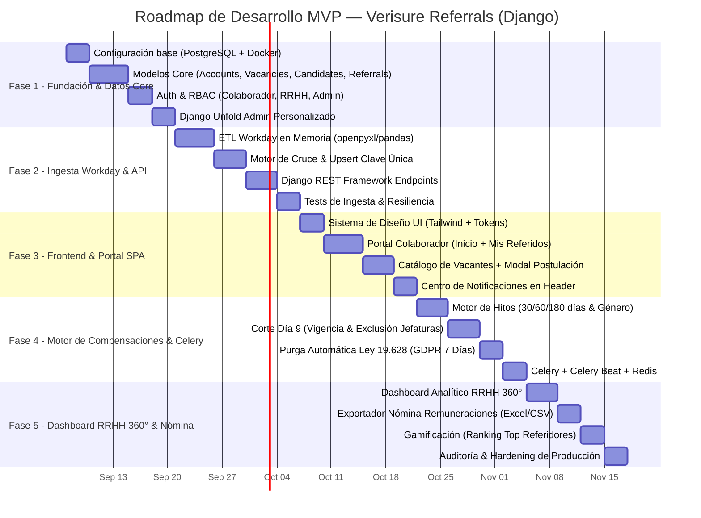
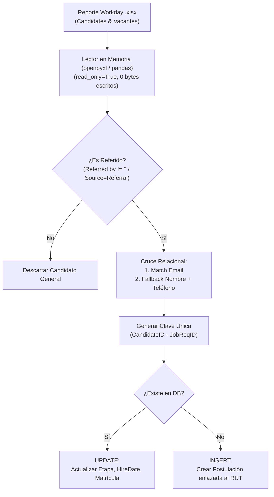
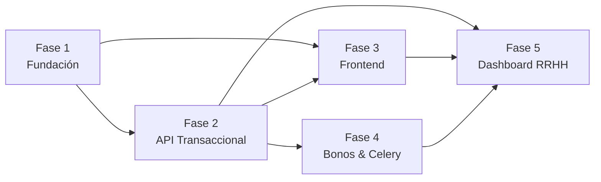

Entiendo perfectamente lo que pasa. El "problema" no es el código en sí, sino **dónde** lo estás previsualizando.

El primer mockup que me enviaste es una captura de cómo se ve un archivo en **GitHub.com**, que tiene su propio motor de estilos (colores, alertas nativas y renderizado de gráficos). Sin embargo, en estas nuevas capturas estás usando la vista previa nativa de **Visual Studio Code**, la cual es mucho más básica. Nunca se verán 100% iguales en local, pero aquí están los dos motivos de por qué se ve raro y cómo solucionarlos:

1. **Los gráficos no cargan:** Por defecto, VS Code no sabe leer los bloques de código `mermaid `. Por eso te muestra el texto crudo en lugar de dibujarte el flujograma.
* *Solución:* Instala la extensión **"Markdown Preview Mermaid Support"** en tu editor, o súbelo directamente a un repositorio de GitHub (ahí se dibujará automáticamente).


2. **La barra de prioridad (Mi error):** En el código anterior te quité el símbolo `>` al principio de la línea de "Prioridad". Ese símbolo (*blockquote*) es el que genera la línea gris vertical a la izquierda. También veo que en tu panel lateral una IA te recomendó poner saltos de línea (enters) en la prioridad; **ignora eso**, en tu mockup original iba todo en una sola línea.

Aquí tienes el código definitivo con la sintaxis corregida. Cópialo completo y, si puedes, pégalo en un Gist secreto en GitHub.com para que veas que ahí sí se renderiza **exactamente** igual a tu mockup original:

```markdown
# Plan de Desarrollo por Fases — MVP Sistema de Gestión de Referidos Verisure (Django)

## Resumen Ejecutivo

Esta propuesta técnica y de arquitectura adapta la solución de **Gestión de Referidos, Integración con Workday (HRIS) y Compensaciones de Verisure Chile** a un stack moderno y escalable basado en **Python & Django**.

El proyecto se estructura en **5 fases incrementales**. Cada fase entrega un componente completamente funcional y testeable, ordenado por **dependencia técnica**, **cumplimiento normativo (Ley 19.628 / GDPR)** y **retorno de valor para RRHH y los colaboradores**.



---

## FASE 1: Fundación del Sistema

> | Prioridad: CRÍTICA — Sin esto no existe nada Estimación: ~2 semanas

### Objetivo

Configurar el proyecto Django correctamente, crear los modelos de datos core y tener un admin funcional para gestionar la información base.

### 1.1 Configuración del Proyecto

* [ ] Migrar de SQLite → **PostgreSQL**
* [ ] Configurar `django-environ` para variables de entorno (`.env`)
* [ ] Configurar `LANGUAGE_CODE = 'es-cl'` y `TIME_ZONE` correcto
* [ ] Estructura de apps según arquitectura propuesta
* [ ] `docker-compose.yml` para desarrollo local (Django, PostgreSQL 16 y Redis 7)
* [ ] `requirements.txt` con dependencias base

### 1.2 Modelos Core — Arquitectura de Apps

#### App `accounts` (Usuarios & Roles)

```python
# Modelo de Usuario personalizado:
Usuario             -> Extiende AbstractUser (OBLIGATORIO hacerlo en Fase 1)
Rol                 -> COLABORADOR, RECLUTADOR_RRHH, ADMINISTRADOR_TI
SupervisoryOrg      -> Gerencia, Área, Departamento, Sucursal

```

> [!CAUTION]
> El modelo de usuario personalizado (`AUTH_USER_MODEL`) DEBE crearse en la Fase 1 antes de la primera migración. Cambiarlo después es extremadamente difícil.

#### App `vacancies` (Catálogo de Requisiciones)

```python
# Requisiciones Workday:
Vacante             -> JobRequisitionID (r2024...), Título, Ubicación, Modalidad, Cupos, TipoCargo (Ventas Terreno, Soporte, Liderazgo), BonoBase, Publicada (bool)

```

#### App `candidates` (PII y Consentimiento GDPR)

```python
# Datos Personales del Postulante:
Candidato           -> RUT (Master Key), Nombre, Apellidos, Email (Match Key), Teléfono, Ciudad/Región, ConsentimientoGDPR (bool), FechaInscripcion

```

#### App `referrals` (Trazabilidad y Etapas Workday)

```python
# Postulación y Tracking de Estados:
Postulacion         -> ClaveUnica (CandidateID + JobRequisitionID), Candidato (FK), Vacante (FK), Referente (FK Usuario), LastRecruitingStage, EstadoTracking, FechaPostulacion, FechaContratacion, EmployeeID (Matrícula Asignada)
HistorialTracking   -> Registro de cambios de etapa con timestamp

```

### 1.3 Admin Personalizado

* [ ] Instalar `django-unfold` para admin moderno
* [ ] Registrar todos los modelos con filtros, búsqueda y acciones
* [ ] Carga de datos iniciales (fixtures) para pruebas

### Entregable Fase 1

Base de datos PostgreSQL estructurada, modelos validados con migraciones y panel administrativo con interfaz moderna para gestionar usuarios, vacantes y postulaciones.

### Estructura de archivos — Fase 1

```text
verisure_referrals/
├── core/
│   ├── settings/
│   │   ├── __init__.py
│   │   ├── base.py          # Settings compartidos
│   │   ├── development.py   # Settings de desarrollo
│   │   └── production.py    # Settings de producción
│   ├── asgi.py
│   ├── urls.py
│   └── wsgi.py
├── apps/
│   ├── accounts/          # Custom User, Roles, Permisos RBAC
│   ├── vacancies/         # Requisiciones Workday y Catálogo
│   ├── candidates/        # PII Candidatos y Consentimiento Ley 19.628
│   └── referrals/         # Postulaciones, Clave Única y Tracking
├── .env                   # Variables de entorno (NO va al repo)
├── .env.example           # Template de variables
├── docker-compose.yml     # PostgreSQL + Redis
├── requirements.txt
└── manage.py

```

---

## FASE 2: Pipeline de Ingesta Workday (ETL) & API REST

> | Prioridad: CRÍTICA — Motor de sincronización transaccional Estimación: ~2.5 semanas Depende de: Fase 1

### Objetivo

Construir el pipeline ETL en Python para procesar reportes masivos de Workday (`.xlsx` de 106 columnas) en memoria (sin alterar el archivo original), realizar el cruce relacional y Upsert inteligente, junto con la API REST construida en **Django REST Framework**.



### 2.1 Ingesta en Memoria (ETL Python) — App `integrations`

* [ ] **Lector de Flujo Seguro:** Módulo en Python con `openpyxl` en modo `read_only=True` para procesar el reporte sin romper fórmulas ni alterar los autofiltros de la cabecera
* [ ] **Filtro de Referidos en Memoria:** Evaluación estricta de `Referred by` y `Source` para aislar exclusivamente los postulantes recomendados
* [ ] **Regla de Inyección Inmutable:** Preservar siempre el referente original inyectado por la plataforma, impidiendo sobreescrituras nulas
* [ ] **Mapeo Automático de Etapas Workday:**
* `Interview`, `Assessment`, `Phone Screen` → **En Entrevista**
* `Offer` → **Oferta Enviada**
* `Ready for Hire` / `Hire Date` poblado → **Contratado**
* `Termination Reason` poblado → **Desestimado**


### 2.2 Endpoints Django REST Framework (DRF)

| Endpoint | Método | Autenticación | Descripción |
| --- | --- | --- | --- |
| `/api/v1/workday/upload-candidates/` | POST | Admin / RRHH | Carga manual/programada del reporte de candidatos (`.xlsx`) |
| `/api/v1/workday/upload-vacancies/` | POST | Admin / RRHH | Carga del reporte de vacantes de Chile (`.xlsx`) |
| `/api/v1/vacancies/` | GET | Token / Session | Catálogo de vacantes abiertas con filtros de bono y región |
| `/api/v1/referrals/` | GET, POST | Colaborador | Listar referidos propios y postular nuevo candidato |
| `/api/v1/referrals/{id}/status/` | GET | Colaborador | Consultar historial de avance de un referido |
| `/api/v1/compensations/summary/` | GET | Colaborador | Resumen de bonos ganados y próximos a liquidar |

> [!IMPORTANT]
> Se debe utilizar una clave de idempotencia única `CandidateID-JobRequisitionID` para prevenir duplicados ante múltiples cargas del mismo mes.

### 2.3 Resiliencia e Idempotencia

* [ ] Logging estructurado con detalle de registros insertados, actualizados y descartados
* [ ] Suite de pruebas unitarias y de integración para simular datasets de 20, 60 y 985 candidatos

### Entregable Fase 2

Pipeline de ingesta verificado con archivos reales de Workday, endpoints REST documentados en Swagger/OpenAPI (`drf-spectacular`) y suite de tests automatizados.

---

## FASE 3: Frontend Responsivo (SPA) — Portal del Colaborador

> | Prioridad: ALTA — Interfaz de usuario final y experiencia corporativa Estimación: ~2.5 semanas Depende de: Fase 1 y 2

### Objetivo

Crear una interfaz web responsiva, ágil y de alta fidelidad visual inspirada en los mockups aprobados, utilizando Django Templates + HTMX + Alpine.js con navegación optimizada.

### 3.1 Sistema de Diseño

* [ ] CSS custom con variables corporativas Verisure (Rojo #E60000)
* [ ] Componentes base: cards, tablas, formularios, modales
* [ ] Layout responsivo con CSS Grid/Flexbox
* [ ] Tema oscuro/claro nativo

### 3.2 Vistas principales

| Vista | Usuarios | Descripción |
| --- | --- | --- |
| Dashboard Personal | Colaborador | KPIs en tiempo real (Referidos, En Proceso, Contratados, Bonos) |
| Mis Referidos | Colaborador | Buscador en vivo por RUT/Nombre, filtros por etapa |
| Catálogo de Vacantes | Todos | Grid de ofertas activas con bonos destacados |
| Modal "Referir" | Colaborador | Formulario con validación de RUT chileno en vivo y GDPR |
| Notificaciones | Todos | Centro de alertas en cabecera de cambio de etapa |

### 3.3 Tecnología Frontend

```text
Django Templates + HTMX + Alpine.js
├── HTMX        -> Búsquedas en tiempo real, filtros dinámicos y carga sin recargar página
├── Alpine.js   -> Modales, toggles y alertas emergentes
├── TailwindCSS -> Sistema de diseño con tokens
└── Chart.js    -> Gráfico de Embudo de Selección y distribución regional

```

> [!NOTE]
> Este enfoque (*HTML-over-the-wire*) mantiene toda la lógica de negocio en Django. No necesitas un frontend separado. HTMX + Alpine.js dan una experiencia moderna sin la complejidad de React/Vue.

### Entregable Fase 3

Portal web completo con diseño corporativo premium, altamente interactivo, funcional en celulares y escritorio.

---

## FASE 4: Motor de Compensaciones, Reglas de Negocio & Celery

> | Prioridad: MEDIA-ALTA — Automatización de nómina y cumplimiento legal Estimación: ~2 semanas Depende de: Fase 2

### Objetivo

Implementar el motor de cálculo de bonos según familia de cargo e hitos de permanencia, la tarea programada del Día 9 de cada mes y la purga automática de datos sensibles (Ley 19.628 / GDPR) con Celery y Redis.

### 4.1 App `compensations` (Motor de Bonos)

```python
# Modelos:
Bono                -> Postulacion (FK), Hito (30D, 60D, 180D), MontoCalculado, Estado
ReglaCompensacion   -> TipoCargo, GeneroCandidato, DiasRequeridos, MontoLiquido

```

### 4.2 Celery — Tareas en Background

* [ ] **Evaluación de Hitos Diaria:** Calcula si un candidato contratado cumplió sus 30, 60 o 180 días.
* [ ] **Corte del Día 9 de cada Mes:** Cruza postulaciones contra dotación activa y excluye jefaturas.
* [ ] **Purga Automatizada GDPR 7 Días:** Elimina físicamente PII de candidatos desestimados y registra hash SHA-256.

### 4.3 Infraestructura de Producción

* [ ] PgBouncer para pool de conexiones PostgreSQL
* [ ] Nginx como reverse proxy
* [ ] Gunicorn con workers configurados
* [ ] Health checks y monitoring básico

### Entregable Fase 4

Sistema autónomo de compensaciones con cálculo exacto de incentivos, ejecución calendarizada y cumplimiento de la Ley 19.628.

---

## FASE 5: Dashboard RRHH 360°, Reportes de Nómina & Cierre

> | Prioridad: MEDIA — Consola de control gerencial Estimación: ~2.5 semanas Depende de: Fase 2 y 4

### Objetivo

Construir la consola ejecutiva de RRHH para visualización analítica nacional, exportación formal de archivos de remuneraciones y módulo de gamificación.

### 5.1 Dashboard Analítico RRHH 360°

* [ ] Total de referidos, tasa de conversión (%) y tiempo promedio de contratación.
* [ ] Selector por Gerencia, Cargo, Región/Ciudad y rango de fechas.
* [ ] Distribución Geográfica de cobertura.

### 5.2 Módulo de Gamificación & Exportación

* [ ] Ranking dinámico de Top 10 Referidores.
* [ ] Generación de planilla oficial de compensaciones en Excel (`.xlsx`) y CSV para remuneraciones.

### Entregable Fase 5

Plataforma analítica 360° para RRHH, exportación de nóminas contables y documentación operativa lista.

---

## Resumen de Fases

| Fase | Nombre | Prioridad | Estimación | Depende de |
| --- | --- | --- | --- | --- |
| **1** | Fundación del Sistema | Crítica | ~2 semanas | — |
| **2** | Pipeline ETL & API REST | Crítica | ~2.5 semanas | Fase 1 |
| **3** | Frontend Responsivo | Alta | ~2.5 semanas | Fases 1, 2 |
| **4** | Bonos & Celery | Media-Alta | ~2 semanas | Fase 2 |
| **5** | Dashboard RRHH & Nómina | Media | ~2.5 semanas | Fases 2, 4 |

> Tiempo total estimado: ~11.5 semanas (asumiendo 1 desarrollador a tiempo completo)



```

```
